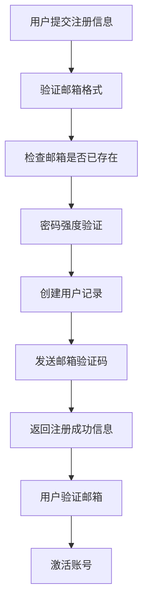
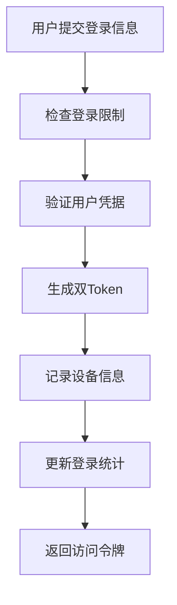
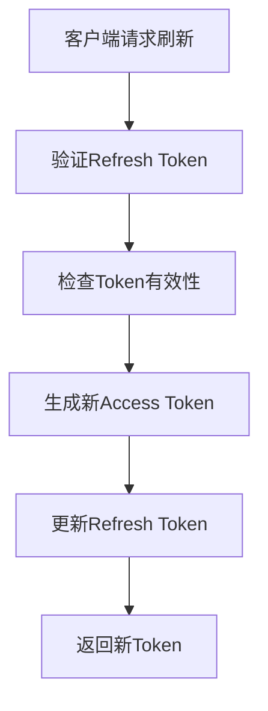

# 认证系统模块

## 概述

认证系统是万花电商平台的核心安全模块，提供完整的用户认证、授权和安全防护机制。

## 核心特性

### ✅ 已实现功能
- 邮箱密码注册/登录
- Google OAuth2 集成
- 双Token机制 (Access + Refresh)
- 设备管理和信任机制
- 邮箱验证码验证
- 防暴力破解保护
- 登录尝试记录和限制

### 🔄 计划功能
- 多因素认证 (MFA)
- 短信验证码
- 更多第三方登录 (Facebook, GitHub)
- 安全审计日志

## 技术实现

### 认证流程

#### 1. 用户注册流程


#### 2. 登录流程


#### 3. Token刷新流程


### 数据库设计

#### 核心表结构

认证系统包含以下核心表：
- **User**: 用户基础信息，支持第三方登录
- **RefreshToken**: 刷新令牌管理，支持设备绑定
- **EmailVerification**: 邮箱验证码管理
- **LoginAttempt**: 登录尝试记录，防暴力破解
- **UserDevice**: 用户设备管理，支持信任机制

详细表结构请参考 Prisma Schema 文件。

### API接口

认证系统提供以下核心接口：
- **POST /auth/register** - 用户注册
- **POST /auth/verify-email** - 邮箱验证
- **POST /auth/login** - 用户登录
- **POST /auth/refresh** - 刷新Token
- **POST /auth/logout** - 用户登出
- **GET /auth/google** - Google OAuth2登录
- **GET /auth/google/callback** - Google OAuth2回调
- **POST /auth/send-verification-code** - 发送验证码

详细的API接口文档请参考 Swagger 文档。

### 安全机制

#### 1. 密码安全
- 使用bcrypt加密存储
- 密码强度验证
- 密码历史记录 (计划中)

#### 2. Token安全
- Access Token: 15分钟有效期
- Refresh Token: 7天有效期，存储在HttpOnly Cookie
- Token与设备绑定
- 支持Token撤销

#### 3. 防暴力破解
- IP限制: 1小时内失败超过10次则限制
- 邮箱限制: 1小时内失败超过5次则限制
- 验证码频率限制: 同一邮箱1分钟内只能发送一次

#### 4. 设备管理
- 设备指纹识别
- 受信任设备机制
- 设备信息记录
- 异常登录检测

### 权限控制

#### 角色定义
```typescript
enum UserRole {
  USER = 'USER',           // 普通用户
  STAFF = 'STAFF',         // 员工
  ADMIN = 'ADMIN'          // 管理员
}
```

#### 权限装饰器
```typescript
@Roles('ADMIN')           // 仅管理员
@Roles('STAFF', 'ADMIN')  // 员工和管理员
@Public()                 // 公开接口
```

#### 守卫使用
```typescript
@UseGuards(JwtAuthGuard, RolesGuard)
@Roles('ADMIN')
async adminOnlyEndpoint() {
  // 仅管理员可访问
}
```

### 配置说明

#### 环境变量
```env
# JWT配置
JWT_SECRET=your_jwt_secret_key
JWT_EXPIRES_IN=15m

# Google OAuth2配置
GOOGLE_CLIENT_ID=your_google_client_id
GOOGLE_CLIENT_SECRET=your_google_client_secret
GOOGLE_CALLBACK_URL=http://localhost:3000/auth/google/callback

# 前端URL
FRONTEND_URL=http://localhost:3001

# 邮件配置
SMTP_HOST=smtp.gmail.com
SMTP_PORT=587
SMTP_USER=your_email@gmail.com
SMTP_PASS=your_app_password
```

### 服务架构

#### 核心服务
- **AuthService**: 认证业务逻辑
- **EmailVerificationService**: 邮箱验证服务
- **RefreshTokenService**: 刷新令牌管理
- **LoginAttemptService**: 登录尝试记录
- **DeviceService**: 设备管理服务
- **PasswordService**: 密码处理服务

#### 策略和守卫
- **JwtStrategy**: JWT验证策略
- **GoogleStrategy**: Google OAuth2策略
- **JwtAuthGuard**: JWT认证守卫
- **RolesGuard**: 角色权限守卫

### 错误处理

#### 常见错误码
- `AUTH_001`: 邮箱已存在
- `AUTH_002`: 邮箱未验证
- `AUTH_003`: 密码错误
- `AUTH_004`: 账号被锁定
- `AUTH_005`: Token已过期
- `AUTH_006`: 验证码错误
- `AUTH_007`: 验证码已过期
- `AUTH_008`: 登录尝试过多

### 监控和日志

#### 日志记录
- 登录成功/失败
- Token生成和刷新
- 邮箱验证操作
- 设备注册和更新
- 异常登录行为

#### 监控指标
- 登录成功率
- Token刷新频率
- 邮箱验证成功率
- 异常登录次数
- 设备信任率

### 测试策略

#### 单元测试
- 服务层业务逻辑测试
- 工具函数测试
- 验证器测试

#### 集成测试
- API接口测试
- 数据库操作测试
- 第三方服务集成测试

#### E2E测试
- 完整认证流程测试
- 权限控制测试
- 安全机制测试

---

**相关文档**:
- [系统概览](../architecture/overview.md)
- [数据库设计](../architecture/database.md)
- [API设计规范](../architecture/api-standards.md)
- [开发环境搭建](../development/setup.md)

