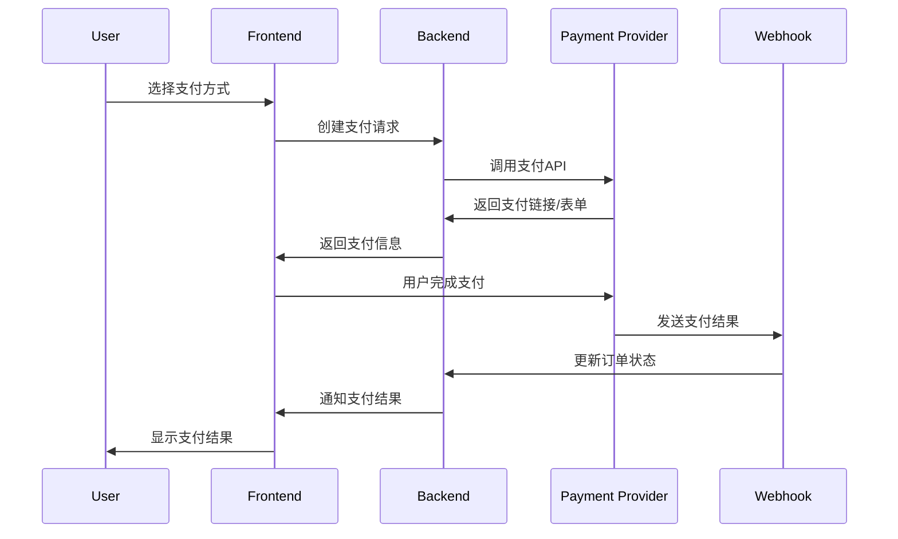

# 支付系统设计文档

## 概述

本文档描述了万花电商系统的支付系统设计，包括线下支付确认功能和未来在线支付集成（Stripe、PayPal等）的架构设计。

## 当前实现功能

### 1. 线下支付确认系统

#### 功能特性
- **管理员权限控制**：只有管理员和员工可以确认线下支付
- **支付方式支持**：现金、银行转账、电汇、支票等
- **金额验证**：确保支付金额与订单金额匹配
- **支付日志**：完整记录所有支付确认操作
- **状态更新**：自动更新订单状态和支付状态

#### 支持的支付方式
```typescript
enum PaymentMethod {
  CASH         // 现金
  BANK_TRANSFER // 银行转账
  WIRE_TRANSFER // 电汇
  CHECK        // 支票
  STRIPE       // Stripe支付
  PAYPAL       // PayPal支付
  ALIPAY       // 支付宝
  WECHAT_PAY   // 微信支付
  OTHER        // 其他
}
```

#### API接口
```typescript
PUT /api/orders/:id/confirm-payment
```

**请求参数：**
```typescript
{
  payment_method: PaymentMethod,
  amount: number,
  payment_id?: string,           // 第三方支付ID
  paid_at: string,              // 支付时间
  payment_notes?: string,       // 支付备注
  transaction_reference?: string, // 交易凭证号
  bank_name?: string,           // 银行名称
  account_last_four?: string    // 账户后四位
}
```

### 2. 支付日志系统

#### 数据库设计
```sql
CREATE TABLE payment_logs (
  id                    INT PRIMARY KEY AUTO_INCREMENT,
  order_id              INT NOT NULL,
  payment_method        ENUM(...) NOT NULL,
  amount                DECIMAL(10,2) NOT NULL,
  payment_id            VARCHAR(100),
  paid_at               DATETIME NOT NULL,
  payment_notes         TEXT,
  transaction_reference VARCHAR(100),
  bank_name             VARCHAR(100),
  account_last_four     VARCHAR(10),
  admin_id              INT NOT NULL,
  created_at            DATETIME DEFAULT CURRENT_TIMESTAMP,
  
  INDEX idx_order_id (order_id),
  INDEX idx_payment_method (payment_method),
  INDEX idx_paid_at (paid_at),
  INDEX idx_admin_id (admin_id)
);
```

#### 功能特性
- **完整审计**：记录所有支付确认操作
- **管理员追踪**：记录是哪个管理员确认的支付
- **详细信息**：包含支付方式、金额、时间等完整信息
- **查询优化**：针对常用查询场景建立索引

## 未来在线支付集成设计

### 1. 支付服务架构

#### 核心组件
```
┌─────────────────┐    ┌─────────────────┐    ┌─────────────────┐
│   Frontend      │    │   Backend       │    │   Payment       │
│   (React)       │    │   (NestJS)      │    │   Providers     │
├─────────────────┤    ├─────────────────┤    ├─────────────────┤
│ • Payment Form  │◄──►│ • Payment API   │◄──►│ • Stripe        │
│ • Payment UI    │    │ • Payment Svc   │    │ • PayPal        │
│ • Status Check  │    │ • Webhook Hdlr  │    │ • Alipay        │
└─────────────────┘    └─────────────────┘    │ • WeChat Pay    │
                                              └─────────────────┘
```

#### 支付流程设计


### 2. 支付服务接口设计

#### 支付服务抽象层
```typescript
interface PaymentProvider {
  // 创建支付
  createPayment(orderData: CreatePaymentData): Promise<PaymentResult>;
  
  // 查询支付状态
  getPaymentStatus(paymentId: string): Promise<PaymentStatus>;
  
  // 处理支付回调
  handleWebhook(payload: any, signature: string): Promise<WebhookResult>;
  
  // 退款
  refundPayment(paymentId: string, amount: number): Promise<RefundResult>;
}

interface CreatePaymentData {
  orderId: string;
  amount: number;
  currency: string;
  customerEmail: string;
  returnUrl: string;
  cancelUrl: string;
}

interface PaymentResult {
  paymentId: string;
  paymentUrl?: string;
  status: 'pending' | 'processing' | 'completed' | 'failed';
  expiresAt?: Date;
}
```

#### Stripe集成示例
```typescript
@Injectable()
export class StripePaymentProvider implements PaymentProvider {
  constructor(private stripe: Stripe) {}

  async createPayment(orderData: CreatePaymentData): Promise<PaymentResult> {
    const paymentIntent = await this.stripe.paymentIntents.create({
      amount: Math.round(orderData.amount * 100), // 转换为分
      currency: orderData.currency,
      metadata: {
        orderId: orderData.orderId,
        customerEmail: orderData.customerEmail
      }
    });

    return {
      paymentId: paymentIntent.id,
      status: 'pending',
      expiresAt: new Date(Date.now() + 30 * 60 * 1000) // 30分钟过期
    };
  }

  async handleWebhook(payload: any, signature: string): Promise<WebhookResult> {
    const event = this.stripe.webhooks.constructEvent(
      payload,
      signature,
      process.env.STRIPE_WEBHOOK_SECRET
    );

    switch (event.type) {
      case 'payment_intent.succeeded':
        return this.handlePaymentSuccess(event.data.object);
      case 'payment_intent.payment_failed':
        return this.handlePaymentFailure(event.data.object);
      default:
        return { processed: false };
    }
  }
}
```

#### PayPal集成示例
```typescript
@Injectable()
export class PayPalPaymentProvider implements PaymentProvider {
  constructor(private paypal: PayPalApi) {}

  async createPayment(orderData: CreatePaymentData): Promise<PaymentResult> {
    const payment = await this.paypal.payments.create({
      intent: 'sale',
      payer: {
        payment_method: 'paypal'
      },
      transactions: [{
        amount: {
          total: orderData.amount.toString(),
          currency: orderData.currency
        },
        description: `Order ${orderData.orderId}`,
        custom: orderData.orderId
      }],
      redirect_urls: {
        return_url: orderData.returnUrl,
        cancel_url: orderData.cancelUrl
      }
    });

    return {
      paymentId: payment.id,
      paymentUrl: payment.links.find(link => link.rel === 'approval_url')?.href,
      status: 'pending'
    };
  }
}
```

### 3. 支付状态管理

#### 订单状态流转
```
PENDING (待付款)
    ↓
PAID (已付款) ← 支付成功
    ↓
PROCESSING (处理中) ← 开始处理订单
    ↓
SHIPPED (已发货) ← 商品发货
    ↓
DELIVERED (已送达) ← 商品送达
    ↓
COMPLETED (已完成) ← 订单完成
```

#### 支付状态流转
```
PENDING (待支付)
    ↓
PROCESSING (支付中) ← 用户发起支付
    ↓
PAID (已支付) ← 支付成功
    ↓
FAILED (支付失败) ← 支付失败
```

### 4. Webhook处理系统

#### Webhook处理器
```typescript
@Controller('webhooks')
export class WebhookController {
  constructor(
    private paymentService: PaymentService,
    private orderService: OrderService
  ) {}

  @Post('stripe')
  async handleStripeWebhook(@Req() req, @Res() res) {
    const signature = req.headers['stripe-signature'];
    const payload = req.body;

    try {
      const result = await this.paymentService.handleStripeWebhook(payload, signature);
      
      if (result.processed) {
        // 更新订单状态
        await this.orderService.updateOrderStatus(
          result.orderId, 
          result.status, 
          result.paymentId
        );
      }

      res.status(200).send('OK');
    } catch (error) {
      res.status(400).send('Webhook Error');
    }
  }

  @Post('paypal')
  async handlePayPalWebhook(@Req() req, @Res() res) {
    // PayPal webhook处理逻辑
  }
}
```

### 5. 支付安全设计

#### 安全措施
1. **Webhook签名验证**：验证所有支付回调的真实性
2. **金额验证**：确保支付金额与订单金额一致
3. **幂等性处理**：防止重复处理相同的支付事件
4. **日志记录**：记录所有支付操作和状态变更
5. **权限控制**：限制支付相关操作的访问权限

#### 数据加密
```typescript
// 敏感数据加密存储
@Column({
  type: 'varchar',
  transformer: {
    to: (value: string) => encrypt(value),
    from: (value: string) => decrypt(value)
  }
})
paymentId: string;
```

### 6. 监控和告警

#### 支付监控指标
- 支付成功率
- 支付失败率
- 平均支付时间
- 退款率
- 异常支付检测

#### 告警规则
- 支付失败率超过阈值
- 异常大额支付
- 支付服务不可用
- Webhook处理失败

## 实施计划

### 阶段1：基础支付功能（已完成）
- ✅ 线下支付确认系统
- ✅ 支付日志记录
- ✅ 订单状态管理

### 阶段2：在线支付集成
- [ ] Stripe支付集成
- [ ] PayPal支付集成
- [ ] 支付状态同步
- [ ] Webhook处理系统

### 阶段3：高级功能
- [ ] 退款处理
- [ ] 分期付款
- [ ] 订阅支付
- [ ] 多币种支持

### 阶段4：优化和监控
- [ ] 支付性能优化
- [ ] 监控告警系统
- [ ] 数据分析报表
- [ ] 安全审计

## 配置管理

### 环境变量
```env
# Stripe配置
STRIPE_PUBLISHABLE_KEY=pk_test_...
STRIPE_SECRET_KEY=sk_test_...
STRIPE_WEBHOOK_SECRET=whsec_...

# PayPal配置
PAYPAL_CLIENT_ID=...
PAYPAL_CLIENT_SECRET=...
PAYPAL_MODE=sandbox

# 支付配置
PAYMENT_CURRENCY=USD
PAYMENT_TIMEOUT=1800
```

### 数据库配置
```sql
-- 支付配置表
CREATE TABLE payment_configs (
  id INT PRIMARY KEY AUTO_INCREMENT,
  provider VARCHAR(50) NOT NULL,
  config_key VARCHAR(100) NOT NULL,
  config_value TEXT,
  is_active BOOLEAN DEFAULT TRUE,
  created_at DATETIME DEFAULT CURRENT_TIMESTAMP,
  updated_at DATETIME DEFAULT CURRENT_TIMESTAMP ON UPDATE CURRENT_TIMESTAMP
);
```

## 总结

本支付系统设计提供了：

1. **完整的线下支付确认流程**
2. **可扩展的在线支付集成架构**
3. **安全的支付处理机制**
4. **详细的审计和监控系统**
5. **灵活的配置管理**

该设计支持多种支付方式，具有良好的可扩展性和安全性，能够满足跨境电商的复杂支付需求。
